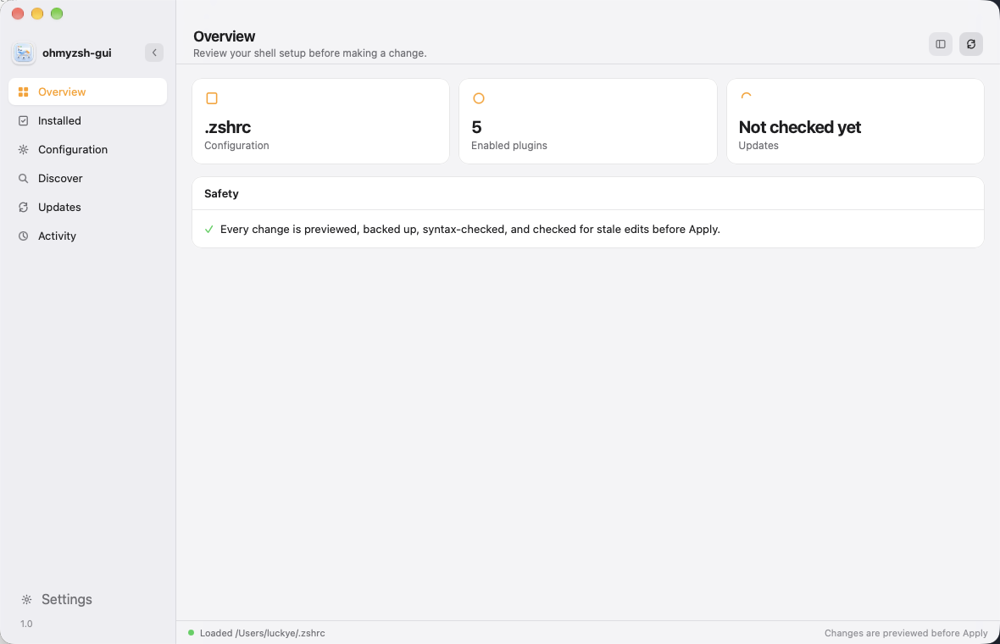
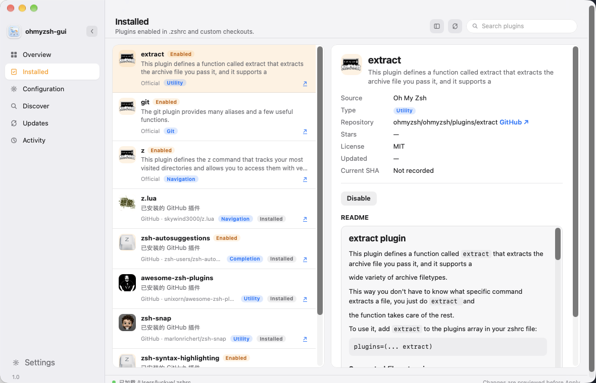
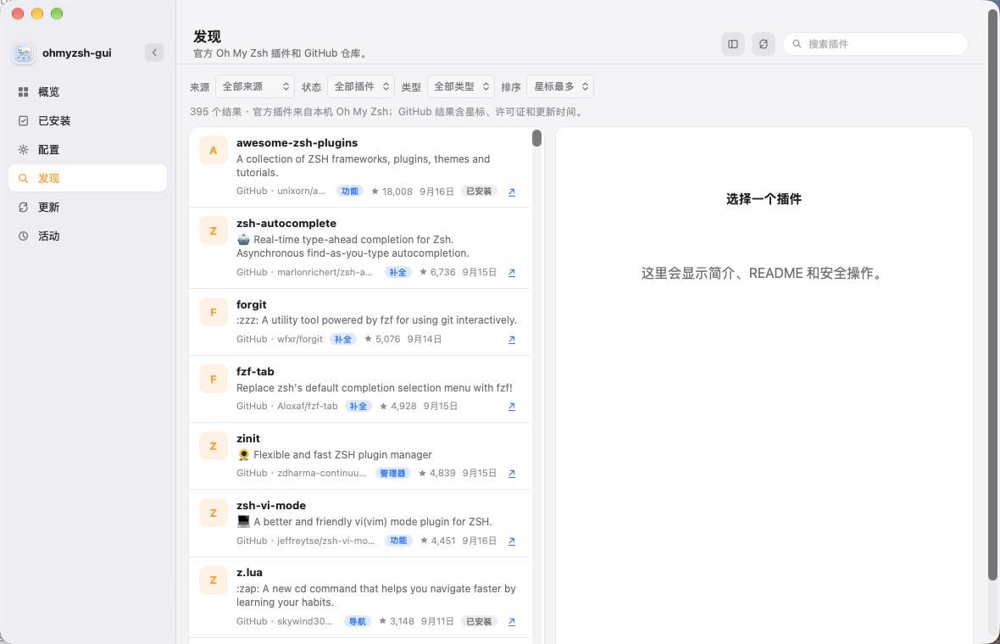
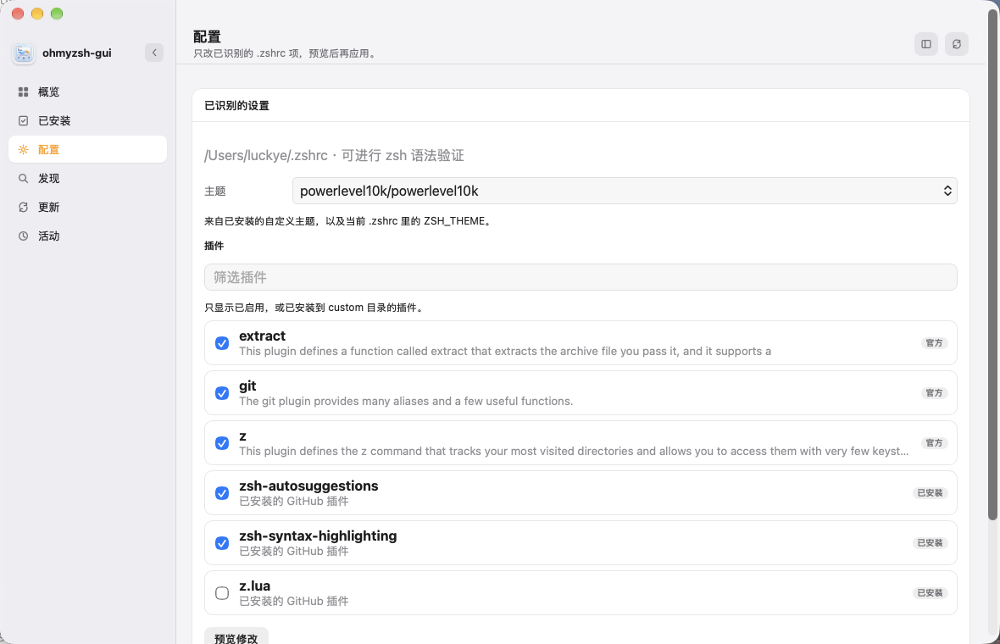
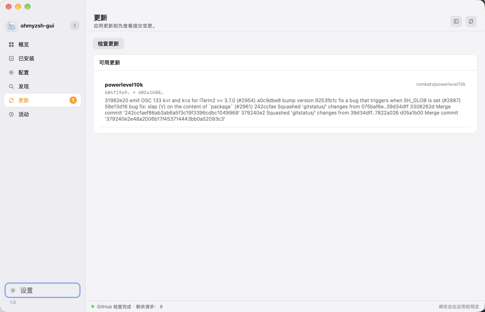
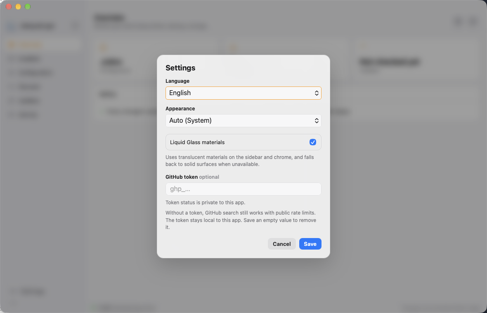

# ohmyzsh-gui

<p align="center">
  <a href="./README.md">English</a> ·
  <a href="./README.zh-CN.md">简体中文</a>
</p>

A desktop app for Oh My Zsh plugins, themes, and `.zshrc`. Every change is previewed, backed up, and syntax-checked with `zsh -n` before Apply.

**1.0** · MIT · Tauri 2 · macOS / Windows / Linux

<p align="center">
  
</p>

## Screenshots

Overview



Installed plugins



Discover on GitHub



Configuration



Updates



Settings



## Features

- Reads the real `~/.zshrc` and only rewrites recognized `ZSH_THEME` / `plugins=()` values
- Enable or disable official Oh My Zsh plugins
- Search GitHub and install plugins or themes (themes go to `custom/themes`, not `plugins=()`)
- Preview a diff, backup, validate with `zsh -n`, then Apply
- Opens a **new terminal** after Apply so the change actually loads
- Activity history with backups and Undo
- Optional GitHub token in the OS credential store; anonymous search still works
- English, Simplified Chinese, or system language; light / dark / system appearance

## Safety

The app never writes `.zshrc` without an explicit Apply. It creates a backup, writes a temporary file, runs `zsh -n`, and replaces the original only after validation succeeds. GitHub sources are limited to `owner/repository` names. Plugin code is never executed by the manager.

## Install

Download **1.0.0** from [Releases](https://github.com/a1024053774/ohmyzsh-gui/releases/tag/v1.0.0). Pick the file for your OS and CPU:

| Platform | Arch | File |
| --- | --- | --- |
| macOS | Apple Silicon | [ohmyzsh-gui_1.0.0_aarch64.dmg](https://github.com/a1024053774/ohmyzsh-gui/releases/download/v1.0.0/ohmyzsh-gui_1.0.0_aarch64.dmg) |
| macOS | Intel | [ohmyzsh-gui_1.0.0_x64.dmg](https://github.com/a1024053774/ohmyzsh-gui/releases/download/v1.0.0/ohmyzsh-gui_1.0.0_x64.dmg) |
| Linux | x86_64 | [AppImage](https://github.com/a1024053774/ohmyzsh-gui/releases/download/v1.0.0/ohmyzsh-gui_1.0.0_amd64.AppImage) · [deb](https://github.com/a1024053774/ohmyzsh-gui/releases/download/v1.0.0/ohmyzsh-gui_1.0.0_amd64.deb) · [rpm](https://github.com/a1024053774/ohmyzsh-gui/releases/download/v1.0.0/ohmyzsh-gui-1.0.0-1.x86_64.rpm) |
| Linux | ARM64 | [AppImage](https://github.com/a1024053774/ohmyzsh-gui/releases/download/v1.0.0/ohmyzsh-gui_1.0.0_aarch64.AppImage) · [deb](https://github.com/a1024053774/ohmyzsh-gui/releases/download/v1.0.0/ohmyzsh-gui_1.0.0_arm64.deb) · [rpm](https://github.com/a1024053774/ohmyzsh-gui/releases/download/v1.0.0/ohmyzsh-gui-1.0.0-1.aarch64.rpm) |
| Windows | x86_64 | [MSI](https://github.com/a1024053774/ohmyzsh-gui/releases/download/v1.0.0/ohmyzsh-gui_1.0.0_x64_en-US.msi) · [setup.exe](https://github.com/a1024053774/ohmyzsh-gui/releases/download/v1.0.0/ohmyzsh-gui_1.0.0_x64-setup.exe) |
| Windows | ARM64 | [MSI](https://github.com/a1024053774/ohmyzsh-gui/releases/download/v1.0.0/ohmyzsh-gui_1.0.0_arm64_en-US.msi) · [setup.exe](https://github.com/a1024053774/ohmyzsh-gui/releases/download/v1.0.0/ohmyzsh-gui_1.0.0_arm64-setup.exe) |

SHA-256 checksums: [SHA256SUMS.txt](https://github.com/a1024053774/ohmyzsh-gui/releases/download/v1.0.0/SHA256SUMS.txt).

Unsigned macOS builds need a right-click → Open the first time. Windows SmartScreen may show a similar prompt.

## Develop

Requires [Oh My Zsh](https://ohmyz.sh), `git`, `zsh`, and [Rust](https://rustup.rs).

```bash
cargo install tauri-cli --version "^2"
cargo tauri dev
node --check src/app.js
cargo test --manifest-path src-tauri/Cargo.toml
```

`cargo test --manifest-path src-tauri/Cargo.toml -- --ignored` runs the live GitHub lifecycle smoke test in a temporary `HOME`.

Build the native app:

```bash
cargo tauri build
```

Output is in `src-tauri/target/release/bundle/`. Signing and notarization need extra Apple / platform certificates.

Read-only browser preview (does not change your shell):

```bash
npm run dev
```

Then open `http://localhost:1420`.

## Notes

- Running terminals do not automatically `source ~/.zshrc`. Use the new window the app opens.
- If `~/.zshrc` still has Powerlevel10k instant prompt and `source ~/.p10k.zsh`, changing `ZSH_THEME` alone will not replace the p10k prompt.
- Plugin managers such as `zsh-snap`, `zinit`, and `antigen` are not Oh My Zsh plugins and cannot go in `plugins=()`.

## License

[MIT](LICENSE)
